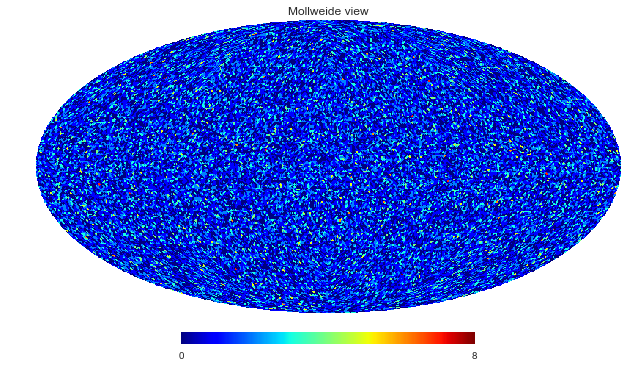
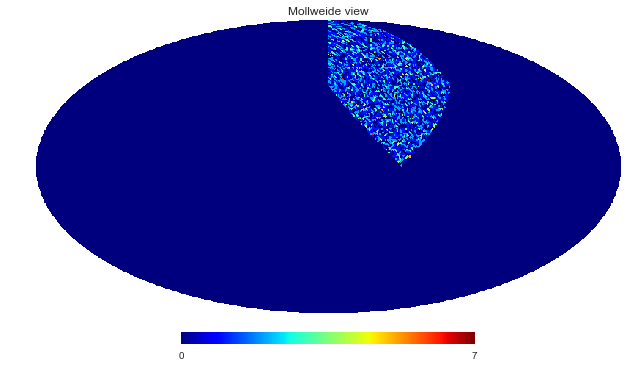
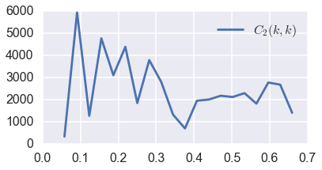

```python
%matplotlib inline
```


```python
import numpy as np
import healpy as hp
import matplotlib.pyplot as plt
import seaborn as sns
sns.set_context('poster')

import ipywidgets as widgets
import CatAna
```

# Basic Types

- Object: Stores position of a particle  
- ObjectContainer: Contains multiple Objects  
- PixelizedObjectContainer: HEALPix-like map, each pixel contains radii of contained particles  


```python
help(CatAna.basictypes)
```

    Help on module CatAna.basictypes in CatAna:
    
    NAME
        CatAna.basictypes - python bindings of basic types used in CatAna
    
    FILE
        /Users/michael/.python-eggs/CatAna-0.0-py2.7-macosx-10.11-x86_64.egg-tmp/CatAna/basictypes.so
    
    CLASSES
        __builtin__.object
            EigenArrayXXcd
            EigenArrayXXd
            EigenArrayXd
            EigenArrayXi
            FunctionInterpolator
            Object
            ObjectContainer
            PixelizedObjectContainer
        
        class EigenArrayXXcd(__builtin__.object)
         |  Methods defined here:
         |  
         |  __init__(...)
         |      x.__init__(...) initializes x; see help(type(x)) for signature
         |  
         |  ----------------------------------------------------------------------
         |  Data and other attributes defined here:
         |  
         |  __new__ = <built-in method __new__ of type object>
         |      T.__new__(S, ...) -> a new object with type S, a subtype of T
        
        class EigenArrayXXd(__builtin__.object)
         |  Methods defined here:
         |  
         |  __init__(...)
         |      x.__init__(...) initializes x; see help(type(x)) for signature
         |  
         |  ----------------------------------------------------------------------
         |  Data and other attributes defined here:
         |  
         |  __new__ = <built-in method __new__ of type object>
         |      T.__new__(S, ...) -> a new object with type S, a subtype of T
        
        class EigenArrayXd(__builtin__.object)
         |  Methods defined here:
         |  
         |  __init__(...)
         |      x.__init__(...) initializes x; see help(type(x)) for signature
         |  
         |  ----------------------------------------------------------------------
         |  Data and other attributes defined here:
         |  
         |  __new__ = <built-in method __new__ of type object>
         |      T.__new__(S, ...) -> a new object with type S, a subtype of T
        
        class EigenArrayXi(__builtin__.object)
         |  Methods defined here:
         |  
         |  __init__(...)
         |      x.__init__(...) initializes x; see help(type(x)) for signature
         |  
         |  ----------------------------------------------------------------------
         |  Data and other attributes defined here:
         |  
         |  __new__ = <built-in method __new__ of type object>
         |      T.__new__(S, ...) -> a new object with type S, a subtype of T
        
        class FunctionInterpolator(__builtin__.object)
         |  Methods defined here:
         |  
         |  __call__(...)
         |      1. Signature : (CatAna.basictypes.FunctionInterpolator, float) -> float
         |      
         |      2. Signature : (CatAna.basictypes.FunctionInterpolator, array[float]) -> object
         |  
         |  __init__(...)
         |      Signature : (CatAna.basictypes.FunctionInterpolator, function<(float) -> float>, int, float, float) -> NoneType
         |  
         |  ----------------------------------------------------------------------
         |  Data and other attributes defined here:
         |  
         |  __new__ = <built-in method __new__ of type object>
         |      T.__new__(S, ...) -> a new object with type S, a subtype of T
        
        class Object(__builtin__.object)
         |  Methods defined here:
         |  
         |  __init__(...)
         |      1. Signature : (CatAna.basictypes.Object) -> NoneType
         |      
         |      2. Signature : (CatAna.basictypes.Object, float, float, float) -> NoneType
         |  
         |  cartesian(...)
         |      Signature : (CatAna.basictypes.Object) -> (float, float, float)
         |  
         |  spherical(...)
         |      Signature : (CatAna.basictypes.Object) -> (float, float, float)
         |  
         |  ----------------------------------------------------------------------
         |  Data and other attributes defined here:
         |  
         |  __new__ = <built-in method __new__ of type object>
         |      T.__new__(S, ...) -> a new object with type S, a subtype of T
        
        class ObjectContainer(__builtin__.object)
         |  Methods defined here:
         |  
         |  __getitem__(...)
         |      Signature : (CatAna.basictypes.ObjectContainer, int) -> CatAna.basictypes.Object
         |  
         |  __init__(...)
         |      1. Signature : (CatAna.basictypes.ObjectContainer) -> NoneType
         |      
         |      2. Signature : (CatAna.basictypes.ObjectContainer, array[float], unicode) -> NoneType
         |  
         |  add_object(...)
         |      Signature : (CatAna.basictypes.ObjectContainer, CatAna.basictypes.Object) -> NoneType
         |  
         |  ----------------------------------------------------------------------
         |  Data and other attributes defined here:
         |  
         |  __new__ = <built-in method __new__ of type object>
         |      T.__new__(S, ...) -> a new object with type S, a subtype of T
        
        class PixelizedObjectContainer(__builtin__.object)
         |  Methods defined here:
         |  
         |  __init__(...)
         |      1. Signature : (CatAna.basictypes.PixelizedObjectContainer, int) -> NoneType
         |      
         |      2. Signature : (CatAna.basictypes.PixelizedObjectContainer, int, CatAna.basictypes.ObjectContainer) -> NoneType
         |  
         |  get_countmap(...)
         |      Signature : (CatAna.basictypes.PixelizedObjectContainer) -> CatAna.basictypes.EigenArrayXi
         |  
         |  ----------------------------------------------------------------------
         |  Data and other attributes defined here:
         |  
         |  __new__ = <built-in method __new__ of type object>
         |      T.__new__(S, ...) -> a new object with type S, a subtype of T
    
    


## Objects and ObjectContainers


```python
# Some random particle positions in a 200x200x200 box
python_particles = np.random.uniform(-100,100,(100000,3))
print python_particles[0]
```

    [ 35.52186684 -49.80164133  94.94618743]


```python
# Load into ObjectContainer
object_container = CatAna.ObjectContainer(python_particles, 'cartesian')
```


```python
# Retreive numpy array (now spherical coordinates)
python_particles_from_oc = np.array(object_container)
print python_particles_from_oc[0]
```

    [ 112.94593844    0.57234371    5.33196358]


```python
# Can also construct ObjectContainer from spherical coordinates
object_container_2 = CatAna.ObjectContainer(python_particles_from_oc, 'spherical')
```


```python
# Retreive Object:
obj = object_container[0]
print np.array(obj)
print obj.cartesian()
```

    [ 112.94593844    0.57234371    5.33196358]
    (35.52186684474812, -49.8016413275625, 94.94618743044855)


## PixelizedObjectContainers


```python
# Create from NSide and ObjectContainer
pixelized_object_container = CatAna.PixelizedObjectContainer(64, object_container)
```


```python
# Retreive count-map (how many object each pixel contains)
hp.mollview(np.array(pixelized_object_container.get_countmap()))
```


-------
# IO
- PySource: Load data from file
- PySink: Write data to file
- PyFilter: Apply Filter to data
- PyFilterStream: Connect Source->Filter(s)->Sink

## PyFilter
- tophat
- gauss
- generic (specify window function r->p, where p is the acceptance probability at distance r (in [0,1])
- AngMask


```python
# TopHat Filter with radius 100
filt_tophat = CatAna.io.PyFilter("tophat", 100)
```


```python
# Apply to ObjectContainer
object_container_filt = CatAna.ObjectContainer(python_particles, 'cartesian')
filt_tophat(object_container_filt)
```


```python
hp.mollview(np.array(CatAna.PixelizedObjectContainer(64, object_container_filt).get_countmap()))
```





```python
#AngMask
mask = np.zeros(12)
mask[3] = 1
filt_mask = CatAna.io.PyFilter("AngMask", mask)
```

    WARNING: AstropyDeprecationWarning: The new_table function is deprecated and may be removed in a future version.
            Use :meth:`BinTableHDU.from_columns` for new BINARY tables or :meth:`TableHDU.from_columns` for new ASCII tables instead. [astropy.utils.decorators]
    WARNING: AstropyDeprecationWarning: The use of header.update() to add new keywords to a header is deprecated.  Instead, use either header.set() or simply `header[keyword] = value` or `header[keyword] = (value, comment)`.  header.set() is only necessary to use if you also want to use the before/after keyword arguments. [astropy.io.fits.header]


```python
# Apply to ObjectContainer
filt_mask(object_container_filt)
```


```python
hp.mollview(np.array(CatAna.PixelizedObjectContainer(64, object_container_filt).get_countmap()))
```





## PySource
Supported Formats
- Text: Set  coord = 'cartesian' | 'spherical' | 'spherical_3dex'
- Gadget


```python

```

## PySink
Supported Formats
- Text: Set  coord = 'cartesian' | 'spherical' | 'spherical_3dex'


```python

```

## PyFilterStream


```python

```

-------
# DECOMP : SFB decomposition
The decomposition can either be directly done from ObjectContainers (brute-force) or PixelizedObjectContainers (fast).
There is also a PyAnalyzer class for convenience to directly process PySource sources with Filters without the need to first load the data into ObjectContainers.


```python
lmax = 5; nmax = 20; rmax=100; window_volume = 4/3.*np.pi * 100**3 
filt_tophat(object_container)
```

## Raw (brute-force) decomposition from ObjectContainer


```python
kclkk = CatAna.decomp.sfb_decomposition(object_container, lmax, nmax, rmax, window_volume, store_flmn = True)
```


```python
k_ln = np.array(kclkk.k_ln)
c_ln = np.array(kclkk.c_ln)
f_2mn = np.array(kclkk.f_lmn[2])  # The f_lmn components for l=2
```


```python
l=2
fig,ax = plt.subplots(1,1,figsize=(6,3))
ax.plot(k_ln[l], c_ln[l], label=r'$C_{}(k,k)$'.format(l))
ax.legend();
```


## Fast decomposition from PixelizedObjectContainer


```python
pix_oc = CatAna.PixelizedObjectContainer(128, object_container)
kclkk = CatAna.decomp.sfb_decomposition(pix_oc, lmax, nmax, rmax, window_volume, store_flmn = True)
```


```python
k_ln = np.array(kclkk.k_ln)
c_ln = np.array(kclkk.c_ln)
f_2mn = np.array(kclkk.f_lmn[2])  # The f_lmn components for l=2
```


```python
l=2
fig,ax = plt.subplots(1,1,figsize=(6,3))
ax.plot(k_ln[l], c_ln[l], label=r'$C_{}(k,k)$'.format(l))
ax.legend();
```





## Directly load from PySource: PyAnalyzer


```python

```
