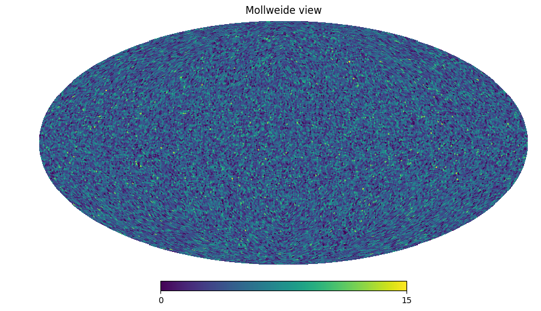
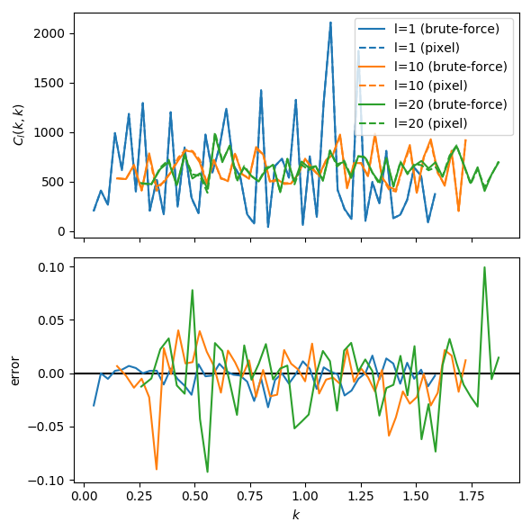
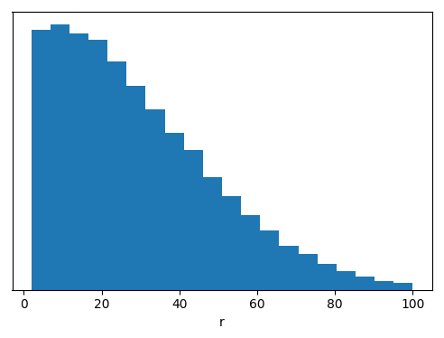

Basic Usage
===========

Points and PointContainers
--------------------------

The main objects in CatAna are `points <Point>`, coordinates in 3d space stored in spherical components.
They can either be directly obtained from python arrays or read from files using the `catana.io` module.

Points are collected in `point containers <PointContainer>`, which can then be given to a spherical Fourier-Bessel
transform routine to analyze.

.. code-block:: python

   import numpy as np
   import catana

   # Some random particle positions in a 200x200x200 box centered at 0
   python_particles = np.random.uniform(-100, 100, (100000, 3))

   # Load into PointContainer
   point_container = catana.PointContainer(python_particles, 'cartesian')

   # If we want to retreive a numpy array from the point_container again
   # (note that the coordinates will be spherical, with columns [r, theta, phi])
   python_particles_spherical = np.array(point_container)

Computing the SFB transform will be faster if the points are binned in angular pixels. CatAna uses the
`HEALPix <http://healpix.sourceforge.net/>`_ pixelization scheme. The resolution of the angular grid is given by
the ``nside`` parameter, which determines how many times each base pixel is subdivided and has to be a power of 2.

CatAna contains a specialized container, the `PixelizedPointContainer`. It can be used as follows:

.. code-block:: python

   # Create a PixelizedPointContainer with nside 64
   pixelized_point_container = catana.PixelizedPointContainer(64, point_container)

   # We can create a HEALPix map with each pixel containing the number of points it contains
   import healpy as hp
   countmap = pixelized_point_container.get_countmap()
   hp.mollview(countmap)

------------------------------------------------------------------------------------------------------------------------

Computing the SFB transform
---------------------------

The SFB decomposition can either be directly done on `PointContainers <PointContainer>` (brute-force) or on
`PixelizedObjectContainers <PixelizedPointContainer>` which is much faster.

.. code-block:: python

   # Parameters
   params = {
       'lmax': 100,  # maximum multipole to compute
       'nmax': 50,  # maximum k-index to compute
       'rmax': 100,  # largest distance to point (field is supposed to be 0 outside this radius)
       'store_flmn': False,  # we're only interested in the C_ln components here
       'verbose': False
   }

   # brute-force from PointContainer (not recommended, will take a while)
   %time kclkk_1 = catana.sfb_decomposition(point_container, **params)

   # using the pixelized container, much faster
   %time kclkk_2 = catana.sfb_decomposition(pixelized_point_container, **params)

On my machine, the recorded times are something like

.. code-block:: none

   CPU times: user 40min 45s, sys: 7.53 s, total: 40min 53s
   Wall time: 5min 29s

   CPU times: user 45.4 s, sys: 1.55 s, total: 46.9 s
   Wall time: 8.93 s

As you can see, the speed-up from the fast method is big. We used a very low pixelization resolution (nside),
hence the errors in the :math:`f_{lmn}` coefficients and even in the :math:`C_{ln}` coefficients are quite large. Here
is from the previous example:

.. code-block:: python

   fig, axes = plt.subplots(2, 1, figsize=(6,6))
   axes[1].axhline(0, color='black')
   for l in [1, 10, 20]:
       g, = axes[0].plot(kclkk_1.k_ln[l], kclkk_1.c_ln[l], label='l={} (brute-force)'.format(l))
       axes[0].plot(kclkk_2.k_ln[l], kclkk_2.c_ln[l], label='l={} (pixel)'.format(l),
           color=g.get_color(), linestyle='dashed')
       axes[1].plot(kclkk_1.k_ln[l], kclkk_2.c_ln[l]/kclkk_1.c_ln[l]-1,
           label='l={}', color=g.get_color())
   axes[0].set(ylabel=r'$C_l(k,k)$', xticklabels=[])
   axes[1].set(xlabel=r'$k$', ylabel=r'error', yticks=[-0.1, -0.05, 0, 0.05, 0.1])
   axes[0].legend()
   fig.tight_layout()

By choosing a larger ``NSide``, the errors will drop significantly while we can still profit from a significant speed
increase over the brute-force method.

.. admonition:: Normalization and shot noise
   :class: note

   The :math:`f_{lmn}` components are computed as

   .. math::

      f_{lmn} = \sqrt{\frac{2}{\pi}} \frac{V}{N} \sum_p k j_l(k r_p) Y_{lm}^{*}(\hat{r}_p),

   where :math:`V=\frac{4}{3} \pi r_{max}^3` is the volume of the supporting tophat with radius :math:`r_{max}`.
   In case the survey window function is not a tophat (e.g. a redshift depending window function or an angular mask)
   you need to normalize the SFB decomposition results by multiplying with the fraction that the true volume occupies in
   the tophat for :math:`f_{lmn}` and by the square of it for :math:`C_{ln}`.

   Due to the discrete nature of our point objects, we add an additional term to the spherical power spectrum of the
   underlying smooth distribution (:math:`C_l(k,k)`), the so-called *shot-noise* (:math:`C_l^{sn}(k,k)`).

   .. math::

      C_l^d(k, k) = C_l(k, k) + C_l^{sn}(k,k)

      C_l^{sn}(k,k) = \frac{V}{N} \frac{2}{\pi} k^2 \int_0^\infty dr \; r^2 \; w(r) \; j_l(k r)^2

   where w(r) is the radial window function. This contribution has to be either computed numerically from a random
   catalog (basically our example above) or analytically. CatAna provides a function to compute these spherical Bessel
   function integrals, see `double_sbessel_integrator`.

------------------------------------------------------------------------------------------------------------------------

Reading Data
------------

The most convenient way to use CatAna in Python is to directly use data from numpy arrays as shown above.
CatAna can however also deal with files in (space delimited) text files and Gadget files. For detailed documentation
take a look at `catana.io`.

.. code-block:: python

   # Save data so that we can read it again (uses [r theta phi] columns)
   sink = catana.io.SphericalTextSink("points.txt")
   sink.write(point_container)

   # Read data from a text file
   source = catana.io.SphericalTextSource("points.txt")
   point_container = source.get_point_container()

   # Other supported text sources and sinks:
   #     - CartesianTextSource / CartesianTextSink
   #     - SphericalTextSource / SphericalTextSink
   #     - SphericalTextSource_3dex / SphericalTextSink_3dex (uses [theta phi r] columns)
   #     - GadgetSource

Filtering Data
--------------

Masking and removing points prior to decomposition can be done directly on the data array. CatAna provides some
additional functionality to filter `PointContainers <PointContainer>` which are illustrated below.

.. code-block:: python

   # Gaussian Filter with scale factor 20
   gaussian_filter = catana.io.GaussianRadialWindowFunctionFilter(50)

   # Apply to our point_container
   gaussian_filter(point_container_2)

   # Plot point radii histogram normalized by the surface at the given radii
   radii = np.array(point_container_2)[:,0]
   fig, ax = plt.subplots(1, 1, figsize=(6,4))
   ax.hist(radii, weights=1/radii**2, bins=20, normed=True)
   ax.set(yticks=[], xlabel='r')

.. code-block:: python

   # Add example
